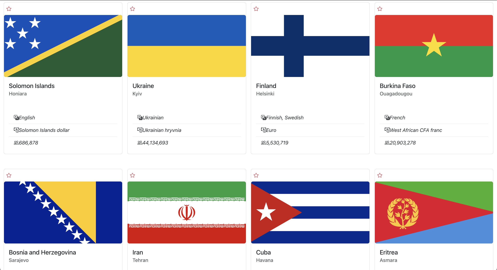

# React Countries Application

This is a study project, simple react countries application using React Redux Library.

## Features

- Only logged user can use the app, so login first.
- You can create account if you don't have one (Firebase used).
- You can search countries, see their details, click on them to see additional info, and "Like" them.
- "Liked" countries are added to the "Favourite" section with search. Also you can clear that list.

## Available Scripts

In the project directory, you can run:

### `npm install`

Install NPM packages

### `npm start`

Runs the app in the development mode.\
Open [http://localhost:3000](http://localhost:3000) to view it in your browser.

## Project preview Screenshot

> Thanks for watch.

